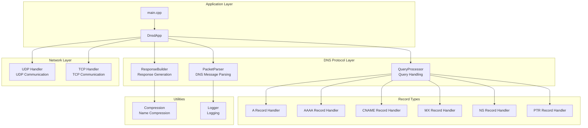
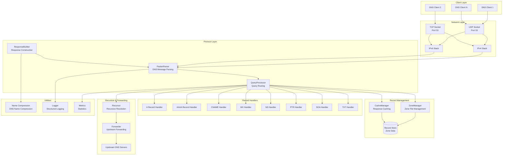
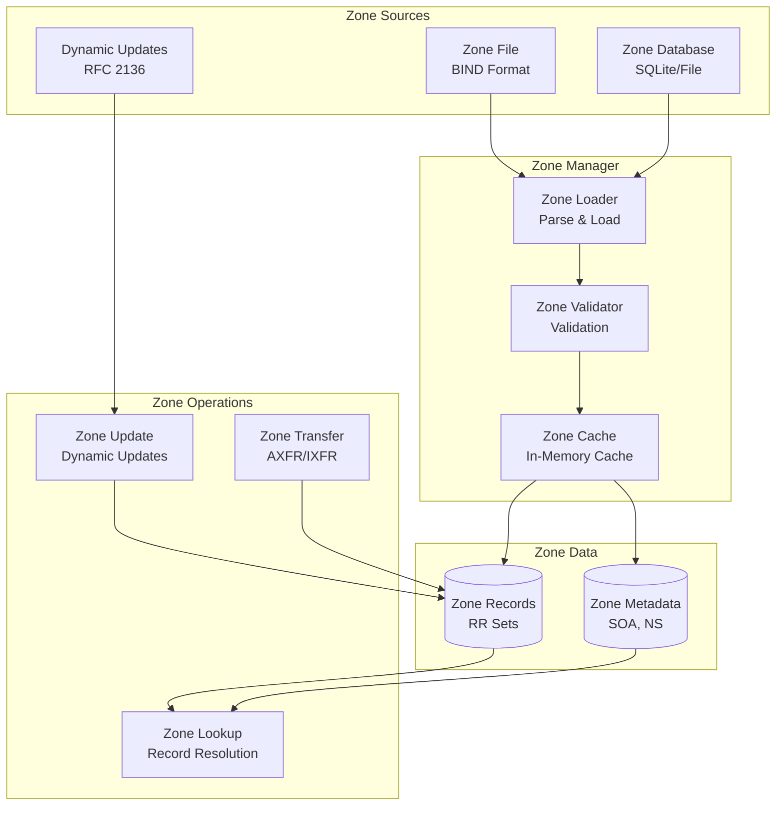
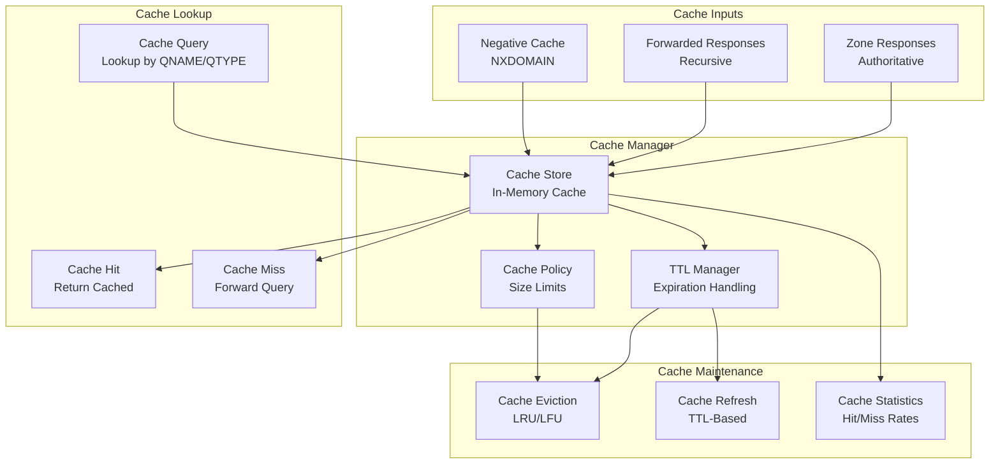
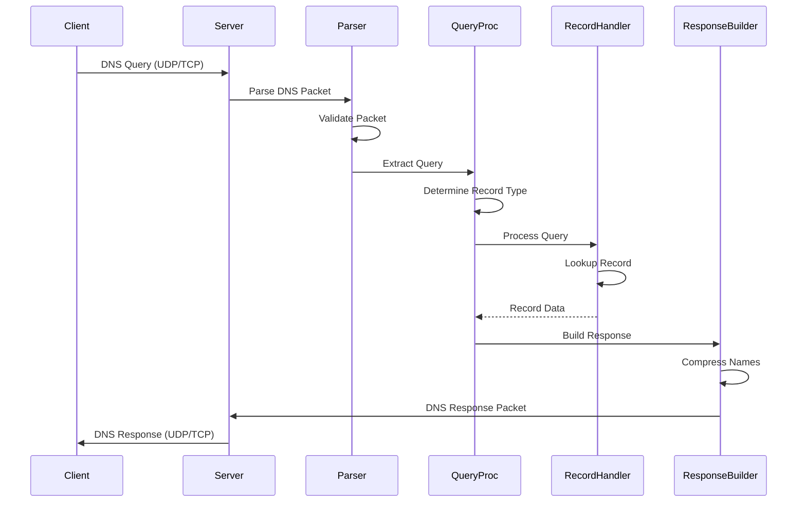

# Simple DNS Daemon - Architecture Diagrams

## System Architecture

```mermaid
graph TB
    subgraph "Application Layer"
        Main[main.cpp]
        App[DnsdApp]
    end

    subgraph "DNS Protocol Layer"
        PacketParser[PacketParser<br/>DNS Message Parsing]
        QueryProcessor[QueryProcessor<br/>Query Handling]
        ResponseBuilder[ResponseBuilder<br/>Response Generation]
    end

    subgraph "Record Types"
        ARecord[A Record Handler]
        AAAARecord[AAAA Record Handler]
        CNAMERecord[CNAME Record Handler]
        MXRecord[MX Record Handler]
        NSRecord[NS Record Handler]
        PTRRecord[PTR Record Handler]
    end

    subgraph "Network Layer"
        UDPHandler[UDP Handler<br/>UDP Communication]
        TCPHandler[TCP Handler<br/>TCP Communication]
    end

    subgraph "Utilities"
        Compression[Compression<br/>Name Compression]
        Logger[Logger<br/>Logging]
    end

    Main --> App
    App --> PacketParser
    App --> QueryProcessor
    App --> ResponseBuilder
    App --> UDPHandler
    App --> TCPHandler

    QueryProcessor --> ARecord
    QueryProcessor --> AAAARecord
    QueryProcessor --> CNAMERecord
    QueryProcessor --> MXRecord
    QueryProcessor --> NSRecord
    QueryProcessor --> PTRRecord

    ResponseBuilder --> Compression
    PacketParser --> Logger
```

## Detailed System Architecture

```mermaid
graph TB
    subgraph "Client Layer"
        Client1[DNS Client 1]
        Client2[DNS Client 2]
        ClientN[DNS Client N]
    end

    subgraph "Network Layer"
        UDP[UDP Socket<br/>Port 53]
        TCP[TCP Socket<br/>Port 53]
        IPv4[IPv4 Stack]
        IPv6[IPv6 Stack]
    end

    subgraph "Protocol Layer"
        Parser[PacketParser<br/>DNS Message Parsing]
        QueryProc[QueryProcessor<br/>Query Routing]
        ResponseBuilder[ResponseBuilder<br/>Response Construction]
    end

    subgraph "Record Management"
        ZoneManager[ZoneManager<br/>Zone File Management]
        CacheManager[CacheManager<br/>Response Caching]
        RecordStore[(Record Store<br/>Zone Data)]
    end

    subgraph "Record Handlers"
        AHandler[A Record Handler]
        AAAHandler[AAAA Record Handler]
        CNAMEHandler[CNAME Handler]
        MXHandler[MX Handler]
        NSHandler[NS Handler]
        PTRHandler[PTR Handler]
        SOAHandler[SOA Handler]
        TXTHandler[TXT Handler]
    end

    subgraph "Recursion & Forwarding"
        Recursor[Recursor<br/>Recursive Resolution]
        Forwarder[Forwarder<br/>Upstream Forwarding]
        Upstream[Upstream DNS Servers]
    end

    subgraph "Utilities"
        Compression[Name Compression<br/>DNS Name Compression]
        Logger[Logger<br/>Structured Logging]
        Metrics[Metrics<br/>Statistics]
    end

    Client1 --> UDP
    Client2 --> TCP
    ClientN --> UDP

    UDP --> IPv4
    UDP --> IPv6
    TCP --> IPv4
    TCP --> IPv6

    IPv4 --> Parser
    IPv6 --> Parser

    Parser --> QueryProc
    QueryProc --> ZoneManager
    QueryProc --> CacheManager
    QueryProc --> AHandler
    QueryProc --> AAAHandler
    QueryProc --> CNAMEHandler
    QueryProc --> MXHandler
    QueryProc --> NSHandler
    QueryProc --> PTRHandler
    QueryProc --> SOAHandler
    QueryProc --> TXTHandler

    ZoneManager --> RecordStore
    CacheManager --> RecordStore

    QueryProc --> Recursor
    Recursor --> Forwarder
    Forwarder --> Upstream

    ResponseBuilder --> Compression
    ResponseBuilder --> Parser

    Parser --> Logger
    QueryProc --> Metrics
```

## Zone Management Architecture

```mermaid
graph TB
    subgraph "Zone Sources"
        ZoneFile[Zone File<br/>BIND Format]
        ZoneDB[Zone Database<br/>SQLite/File]
        DynamicZone[Dynamic Updates<br/>RFC 2136]
    end

    subgraph "Zone Manager"
        ZoneLoader[Zone Loader<br/>Parse & Load]
        ZoneValidator[Zone Validator<br/>Validation]
        ZoneCache[Zone Cache<br/>In-Memory Cache]
    end

    subgraph "Zone Data"
        ZoneRecords[(Zone Records<br/>RR Sets)]
        ZoneMetadata[(Zone Metadata<br/>SOA, NS)]
    end

    subgraph "Zone Operations"
        ZoneLookup[Zone Lookup<br/>Record Resolution]
        ZoneUpdate[Zone Update<br/>Dynamic Updates]
        ZoneTransfer[Zone Transfer<br/>AXFR/IXFR]
    end

    ZoneFile --> ZoneLoader
    ZoneDB --> ZoneLoader
    DynamicZone --> ZoneUpdate

    ZoneLoader --> ZoneValidator
    ZoneValidator --> ZoneCache
    ZoneCache --> ZoneRecords
    ZoneCache --> ZoneMetadata

    ZoneRecords --> ZoneLookup
    ZoneMetadata --> ZoneLookup

    ZoneUpdate --> ZoneRecords
    ZoneTransfer --> ZoneRecords
```

## Caching Architecture

```mermaid
graph TB
    subgraph "Cache Inputs"
        ZoneResponse[Zone Responses<br/>Authoritative]
        ForwardedResponse[Forwarded Responses<br/>Recursive]
        NegativeCache[Negative Cache<br/>NXDOMAIN]
    end

    subgraph "Cache Manager"
        CacheStore[Cache Store<br/>In-Memory Cache]
        TTLManager[TTL Manager<br/>Expiration Handling]
        CachePolicy[Cache Policy<br/>Size Limits]
    end

    subgraph "Cache Lookup"
        CacheQuery[Cache Query<br/>Lookup by QNAME/QTYPE]
        CacheHit[Cache Hit<br/>Return Cached]
        CacheMiss[Cache Miss<br/>Forward Query]
    end

    subgraph "Cache Maintenance"
        CacheEviction[Cache Eviction<br/>LRU/LFU]
        CacheRefresh[Cache Refresh<br/>TTL-Based]
        CacheStats[Cache Statistics<br/>Hit/Miss Rates]
    end

    ZoneResponse --> CacheStore
    ForwardedResponse --> CacheStore
    NegativeCache --> CacheStore

    CacheStore --> TTLManager
    CacheStore --> CachePolicy

    CacheQuery --> CacheStore
    CacheStore --> CacheHit
    CacheStore --> CacheMiss

    TTLManager --> CacheEviction
    CachePolicy --> CacheEviction
    TTLManager --> CacheRefresh

    CacheStore --> CacheStats
```

## DNS Query Processing Flow

```mermaid
sequenceDiagram
    participant Client
    participant Server
    participant Parser
    participant QueryProc
    participant RecordHandler
    participant ResponseBuilder

    Client->>Server: DNS Query (UDP/TCP)
    Server->>Parser: Parse DNS Packet
    Parser->>Parser: Validate Packet
    Parser->>QueryProc: Extract Query
    QueryProc->>QueryProc: Determine Record Type
    QueryProc->>RecordHandler: Process Query
    RecordHandler->>RecordHandler: Lookup Record
    RecordHandler-->>QueryProc: Record Data
    QueryProc->>ResponseBuilder: Build Response
    ResponseBuilder->>ResponseBuilder: Compress Names
    ResponseBuilder->>Server: DNS Response Packet
    Server->>Client: DNS Response (UDP/TCP)
```
