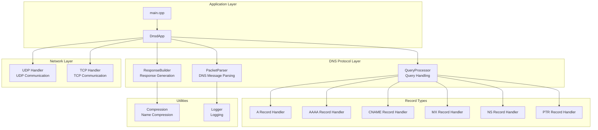
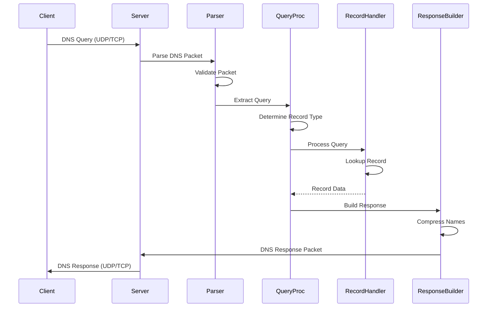

# Simple DNS Daemon - Architecture Diagrams

## System Architecture

```mermaid
graph TB
    subgraph "Application Layer"
        Main[main.cpp]
        App[DnsdApp]
    end
    
    subgraph "DNS Protocol Layer"
        PacketParser[PacketParser<br/>DNS Message Parsing]
        QueryProcessor[QueryProcessor<br/>Query Handling]
        ResponseBuilder[ResponseBuilder<br/>Response Generation]
    end
    
    subgraph "Record Types"
        ARecord[A Record Handler]
        AAAARecord[AAAA Record Handler]
        CNAMERecord[CNAME Record Handler]
        MXRecord[MX Record Handler]
        NSRecord[NS Record Handler]
        PTRRecord[PTR Record Handler]
    end
    
    subgraph "Network Layer"
        UDPHandler[UDP Handler<br/>UDP Communication]
        TCPHandler[TCP Handler<br/>TCP Communication]
    end
    
    subgraph "Utilities"
        Compression[Compression<br/>Name Compression]
        Logger[Logger<br/>Logging]
    end
    
    Main --> App
    App --> PacketParser
    App --> QueryProcessor
    App --> ResponseBuilder
    App --> UDPHandler
    App --> TCPHandler
    
    QueryProcessor --> ARecord
    QueryProcessor --> AAAARecord
    QueryProcessor --> CNAMERecord
    QueryProcessor --> MXRecord
    QueryProcessor --> NSRecord
    QueryProcessor --> PTRRecord
    
    ResponseBuilder --> Compression
    PacketParser --> Logger
```

## DNS Query Processing Flow

```mermaid
sequenceDiagram
    participant Client
    participant Server
    participant Parser
    participant QueryProc
    participant RecordHandler
    participant ResponseBuilder
    
    Client->>Server: DNS Query (UDP/TCP)
    Server->>Parser: Parse DNS Packet
    Parser->>Parser: Validate Packet
    Parser->>QueryProc: Extract Query
    QueryProc->>QueryProc: Determine Record Type
    QueryProc->>RecordHandler: Process Query
    RecordHandler->>RecordHandler: Lookup Record
    RecordHandler-->>QueryProc: Record Data
    QueryProc->>ResponseBuilder: Build Response
    ResponseBuilder->>ResponseBuilder: Compress Names
    ResponseBuilder->>Server: DNS Response Packet
    Server->>Client: DNS Response (UDP/TCP)
```

