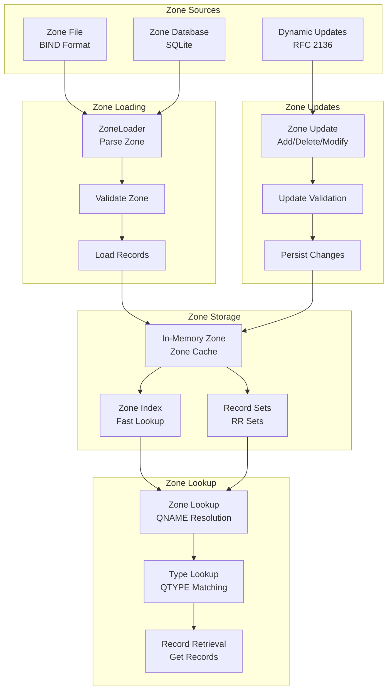
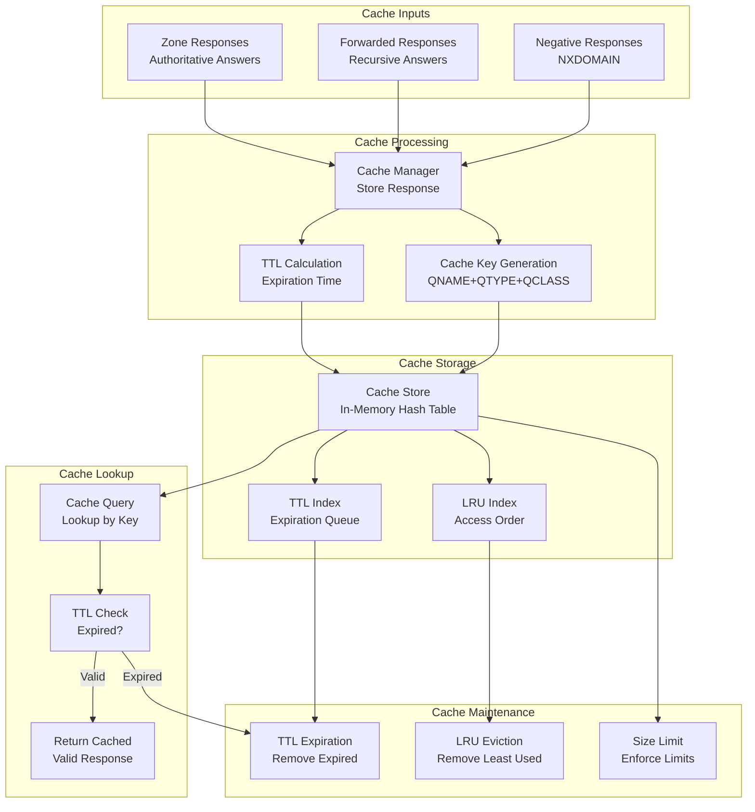
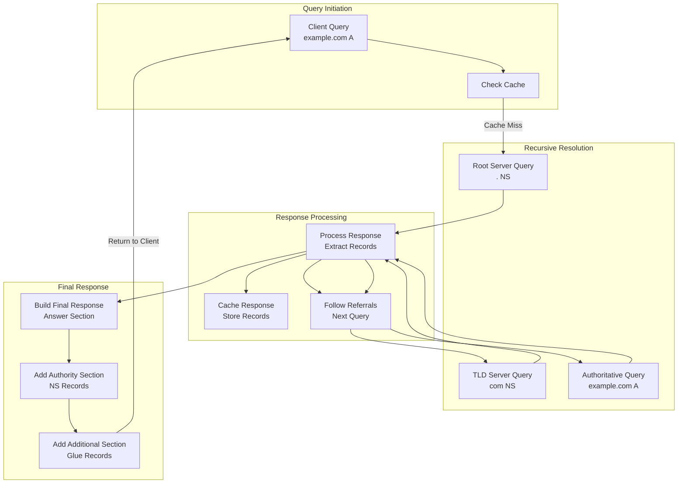
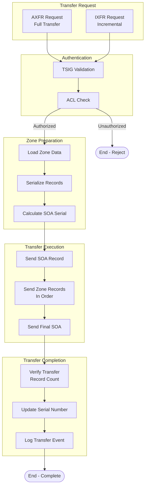

# Simple DNS Daemon - Data Flow Diagrams

## DNS Query Data Flow

```mermaid
flowchart LR
    subgraph "Client"
        C1[DNS Client]
    end

    subgraph "Network"
        N1[UDP/TCP Packet<br/>Port 53]
    end

    subgraph "Server Input"
        S1[Socket<br/>Receive]
        S2[Raw Bytes]
    end

    subgraph "Parsing"
        P1[PacketParser<br/>Deserialize]
        P2[Parsed Message<br/>DNSMessage]
    end

    subgraph "Query Processing"
        Q1[QueryProcessor<br/>Extract Query]
        Q2[Query Info<br/>QNAME, QTYPE, QCLASS]
    end

    subgraph "Resolution"
        R1[Zone Lookup]
        R2[Cache Lookup]
        R3[Recursive Resolution]
    end

    subgraph "Response Building"
        RB1[ResponseBuilder<br/>Build Response]
        RB2[Add Records]
        RB3[Compress Names]
    end

    subgraph "Server Output"
        O1[Socket<br/>Send]
        O2[UDP/TCP Packet<br/>Port 53]
    end

    C1 -->|DNS Query| N1
    N1 --> S1
    S1 --> S2
    S2 --> P1
    P1 --> P2
    P2 --> Q1
    Q1 --> Q2
    Q2 --> R1
    R1 -->|Hit| RB1
    R1 -->|Miss| R2
    R2 -->|Hit| RB1
    R2 -->|Miss| R3
    R3 --> RB1
    RB1 --> RB2
    RB2 --> RB3
    RB3 --> O1
    O1 --> O2
    O2 -->|DNS Response| C1
```

## Zone Data Flow

```mermaid
flowchart TB
    subgraph "Zone Sources"
        ZS1[Zone File<br/>BIND Format]
        ZS2[Zone Database<br/>SQLite]
        ZS3[Dynamic Updates<br/>RFC 2136]
    end

    subgraph "Zone Loading"
        ZL1[ZoneLoader<br/>Parse Zone]
        ZL2[Validate Zone]
        ZL3[Load Records]
    end

    subgraph "Zone Storage"
        ZST1[In-Memory Zone<br/>Zone Cache]
        ZST2[Zone Index<br/>Fast Lookup]
        ZST3[Record Sets<br/>RR Sets]
    end

    subgraph "Zone Lookup"
        ZLU1[Zone Lookup<br/>QNAME Resolution]
        ZLU2[Type Lookup<br/>QTYPE Matching]
        ZLU3[Record Retrieval<br/>Get Records]
    end

    subgraph "Zone Updates"
        ZU1[Zone Update<br/>Add/Delete/Modify]
        ZU2[Update Validation]
        ZU3[Persist Changes]
    end

    ZS1 --> ZL1
    ZS2 --> ZL1
    ZS3 --> ZU1

    ZL1 --> ZL2
    ZL2 --> ZL3
    ZL3 --> ZST1

    ZST1 --> ZST2
    ZST1 --> ZST3

    ZST2 --> ZLU1
    ZST3 --> ZLU1
    ZLU1 --> ZLU2
    ZLU2 --> ZLU3

    ZU1 --> ZU2
    ZU2 --> ZU3
    ZU3 --> ZST1
```

## Cache Data Flow

```mermaid
flowchart TB
    subgraph "Cache Inputs"
        CI1[Zone Responses<br/>Authoritative Answers]
        CI2[Forwarded Responses<br/>Recursive Answers]
        CI3[Negative Responses<br/>NXDOMAIN]
    end

    subgraph "Cache Processing"
        CP1[Cache Manager<br/>Store Response]
        CP2[TTL Calculation<br/>Expiration Time]
        CP3[Cache Key Generation<br/>QNAME+QTYPE+QCLASS]
    end

    subgraph "Cache Storage"
        CS1[Cache Store<br/>In-Memory Hash Table]
        CS2[TTL Index<br/>Expiration Queue]
        CS3[LRU Index<br/>Access Order]
    end

    subgraph "Cache Lookup"
        CL1[Cache Query<br/>Lookup by Key]
        CL2[TTL Check<br/>Expired?]
        CL3[Return Cached<br/>Valid Response]
    end

    subgraph "Cache Maintenance"
        CM1[TTL Expiration<br/>Remove Expired]
        CM2[LRU Eviction<br/>Remove Least Used]
        CM3[Size Limit<br/>Enforce Limits]
    end

    CI1 --> CP1
    CI2 --> CP1
    CI3 --> CP1

    CP1 --> CP2
    CP1 --> CP3
    CP2 --> CS1
    CP3 --> CS1

    CS1 --> CS2
    CS1 --> CS3

    CS1 --> CL1
    CL1 --> CL2
    CL2 -->|Valid| CL3
    CL2 -->|Expired| CM1

    CS2 --> CM1
    CS3 --> CM2
    CS1 --> CM3
```

## Recursive Resolution Data Flow

```mermaid
flowchart TB
    subgraph "Query Initiation"
        QI1[Client Query<br/>example.com A]
        QI2[Check Cache]
    end

    subgraph "Recursive Resolution"
        RR1[Root Server Query<br/>. NS]
        RR2[TLD Server Query<br/>com NS]
        RR3[Authoritative Query<br/>example.com A]
    end

    subgraph "Response Processing"
        RP1[Process Response<br/>Extract Records]
        RP2[Cache Response<br/>Store Records]
        RP3[Follow Referrals<br/>Next Query]
    end

    subgraph "Final Response"
        FR1[Build Final Response<br/>Answer Section]
        FR2[Add Authority Section<br/>NS Records]
        FR3[Add Additional Section<br/>Glue Records]
    end

    QI1 --> QI2
    QI2 -->|Cache Miss| RR1

    RR1 --> RP1
    RP1 --> RP2
    RP1 --> RP3
    RP3 --> RR2

    RR2 --> RP1
    RP1 --> RP3
    RP3 --> RR3

    RR3 --> RP1
    RP1 --> FR1
    FR1 --> FR2
    FR2 --> FR3
    FR3 -->|Return to Client| QI1
```

## Zone Transfer Data Flow

```mermaid
flowchart TB
    subgraph "Transfer Request"
        TR1[AXFR Request<br/>Full Transfer]
        TR2[IXFR Request<br/>Incremental]
    end

    subgraph "Authentication"
        AUTH1[TSIG Validation]
        AUTH2[ACL Check]
    end

    subgraph "Zone Preparation"
        ZP1[Load Zone Data]
        ZP2[Serialize Records]
        ZP3[Calculate SOA Serial]
    end

    subgraph "Transfer Execution"
        TE1[Send SOA Record]
        TE2[Send Zone Records<br/>In Order]
        TE3[Send Final SOA]
    end

    subgraph "Transfer Completion"
        TC1[Verify Transfer<br/>Record Count]
        TC2[Update Serial Number]
        TC3[Log Transfer Event]
    end

    TR1 --> AUTH1
    TR2 --> AUTH1

    AUTH1 --> AUTH2
    AUTH2 -->|Authorized| ZP1
    AUTH2 -->|Unauthorized| End([End - Reject])

    ZP1 --> ZP2
    ZP2 --> ZP3

    ZP3 --> TE1
    TE1 --> TE2
    TE2 --> TE3

    TE3 --> TC1
    TC1 --> TC2
    TC2 --> TC3
    TC3 --> End2([End - Complete])
```
