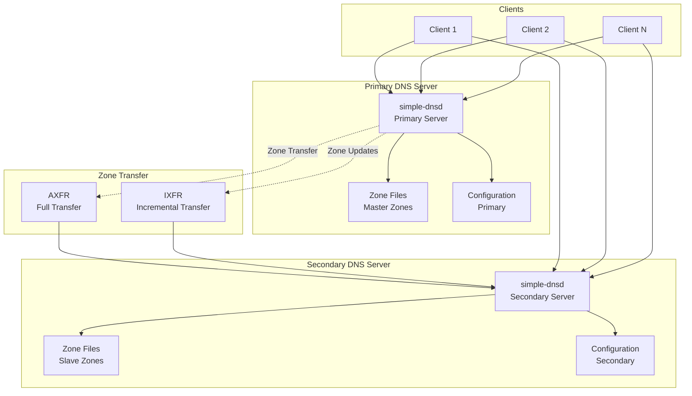
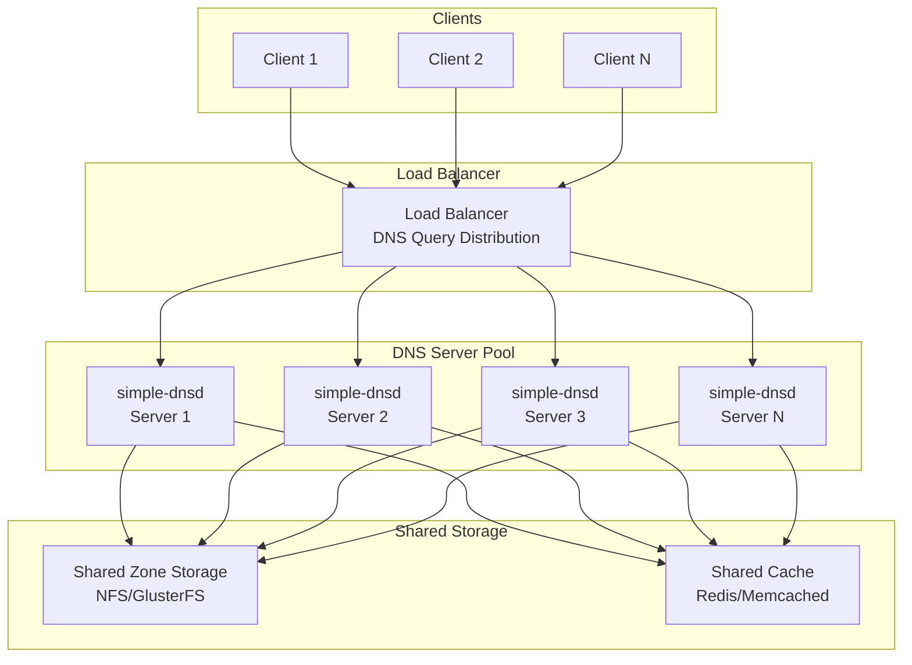
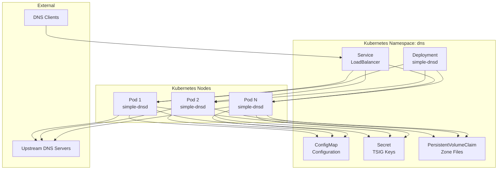
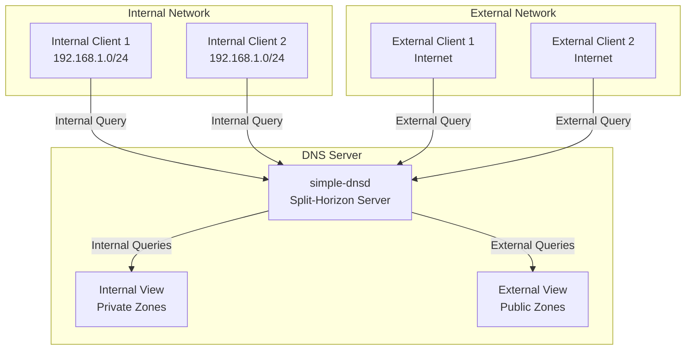

# Simple DNS Daemon - Deployment Diagrams

## Basic Deployment Architecture

```mermaid
graph TB
    subgraph "Client Network"
        Client1[DNS Client 1]
        Client2[DNS Client 2]
        ClientN[DNS Client N]
    end

    subgraph "DNS Server"
        Server[simple-dnsd<br/>Main Process]
        ZoneFiles[/etc/simple-dnsd/zones/<br/>Zone Files]
        Config[/etc/simple-dnsd/<br/>Configuration]
        Cache[/var/cache/simple-dnsd/<br/>Cache Files]
        Logs[/var/log/simple-dnsd/<br/>Log Files]
    end

    subgraph "System Services"
        Systemd[systemd<br/>Service Manager]
        Logrotate[logrotate<br/>Log Rotation]
    end

    subgraph "Upstream DNS"
        Upstream1[Upstream DNS 1<br/>8.8.8.8]
        Upstream2[Upstream DNS 2<br/>8.8.4.4]
    end

    Client1 --> Server
    Client2 --> Server
    ClientN --> Server

    Systemd --> Server
    Systemd --> Config

    Server --> ZoneFiles
    Server --> Config
    Server --> Cache
    Server --> Logs

    Server --> Upstream1
    Server --> Upstream2

    Logrotate --> Logs
```

## Primary-Secondary DNS Setup



## Load Balanced DNS Deployment



## Container Deployment

```mermaid
graph TB
    subgraph "Docker Host"
        Docker[Docker Engine]
        Container[simple-dnsd<br/>Container]
        Volumes[Volumes<br/>Zones/Config/Cache]
        HostNetwork[Host Network<br/>Port 53 UDP/TCP]
    end
    
    subgraph "External"
        Clients[DNS Clients]
        ZoneMount[/host/zones<br/>Zone Files]
        ConfigMount[/host/config<br/>Configuration]
        CacheMount[/host/cache<br/>Cache]
        LogMount[/host/logs<br/>Log Files]
    end
    
    Clients --> HostNetwork
    HostNetwork --> Container
    Container --> Volumes
    
    ZoneMount --> Volumes
    ConfigMount --> Volumes
    CacheMount --> Volumes
    LogMount --> Volumes
    
    Docker --> Container
```

## Kubernetes Deployment



## Split-Horizon DNS


