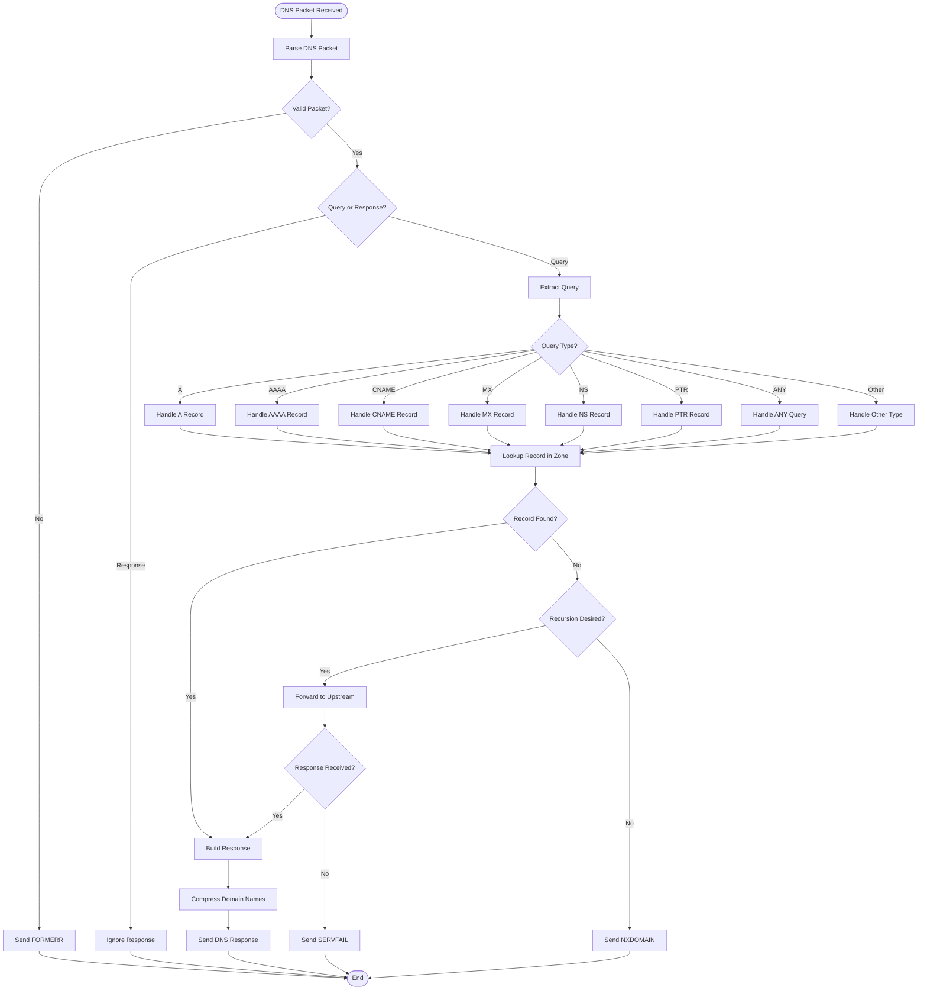
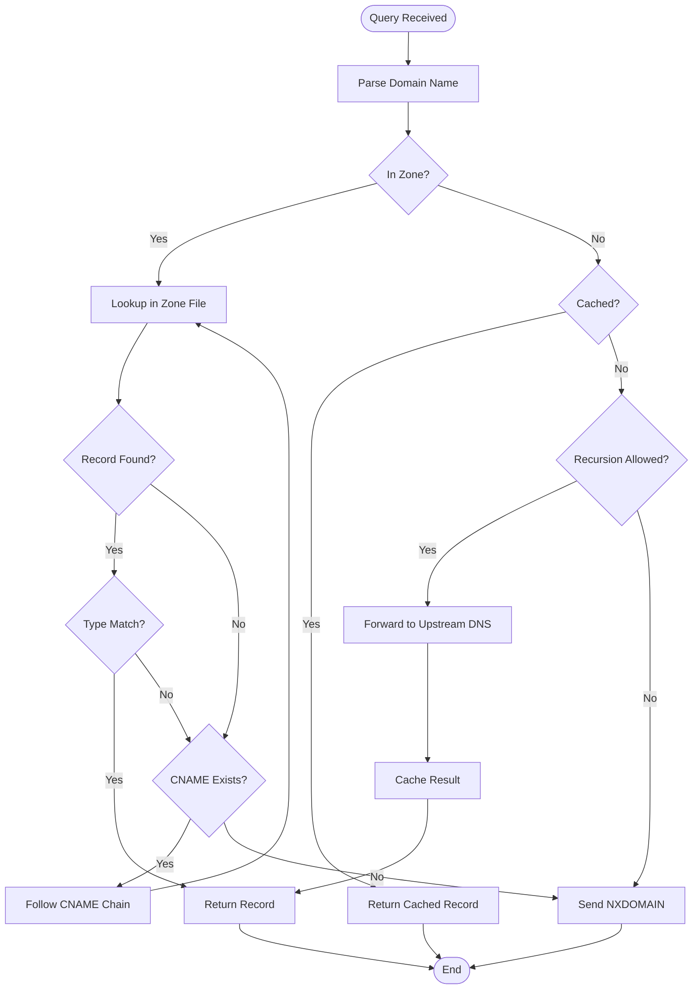

# Simple DNS Daemon - Flow Diagrams

## DNS Query Processing Flow

```mermaid
flowchart TD
    Start([DNS Packet Received]) --> Parse[Parse DNS Packet]
    Parse --> Validate{Valid Packet?}
    Validate -->|No| SendFormErr[Send FORMERR]
    Validate -->|Yes| CheckQR{Query or Response?}
    
    CheckQR -->|Response| Ignore[Ignore Response]
    CheckQR -->|Query| ExtractQuery[Extract Query]
    
    ExtractQuery --> CheckQType{Query Type?}
    CheckQType -->|A| HandleA[Handle A Record]
    CheckQType -->|AAAA| HandleAAAA[Handle AAAA Record]
    CheckQType -->|CNAME| HandleCNAME[Handle CNAME Record]
    CheckQType -->|MX| HandleMX[Handle MX Record]
    CheckQType -->|NS| HandleNS[Handle NS Record]
    CheckQType -->|PTR| HandlePTR[Handle PTR Record]
    CheckQType -->|ANY| HandleANY[Handle ANY Query]
    CheckQType -->|Other| HandleOther[Handle Other Type]
    
    HandleA --> LookupRecord[Lookup Record in Zone]
    HandleAAAA --> LookupRecord
    HandleCNAME --> LookupRecord
    HandleMX --> LookupRecord
    HandleNS --> LookupRecord
    HandlePTR --> LookupRecord
    HandleANY --> LookupRecord
    HandleOther --> LookupRecord
    
    LookupRecord --> Found{Record Found?}
    Found -->|Yes| BuildResponse[Build Response]
    Found -->|No| CheckRecursion{Recursion Desired?}
    
    CheckRecursion -->|Yes| ForwardQuery[Forward to Upstream]
    CheckRecursion -->|No| SendNXDOMAIN[Send NXDOMAIN]
    
    ForwardQuery --> ForwardResponse{Response Received?}
    ForwardResponse -->|Yes| BuildResponse
    ForwardResponse -->|No| SendSERVFAIL[Send SERVFAIL]
    
    BuildResponse --> CompressNames[Compress Domain Names]
    CompressNames --> SendResponse[Send DNS Response]
    
    Ignore --> End([End])
    SendFormErr --> End
    SendNXDOMAIN --> End
    SendSERVFAIL --> End
    SendResponse --> End
```

## DNS Record Lookup Flow

```mermaid
flowchart TD
    Start([Query Received]) --> ParseName[Parse Domain Name]
    ParseName --> CheckZone{In Zone?}
    CheckZone -->|Yes| LookupZone[Lookup in Zone File]
    CheckZone -->|No| CheckCache{Cached?}
    
    CheckCache -->|Yes| ReturnCache[Return Cached Record]
    CheckCache -->|No| CheckRecursion{Recursion Allowed?}
    
    CheckRecursion -->|Yes| Forward[Forward to Upstream DNS]
    CheckRecursion -->|No| SendNXDOMAIN[Send NXDOMAIN]
    
    LookupZone --> Found{Record Found?}
    Found -->|Yes| CheckType{Type Match?}
    Found -->|No| CheckCNAME{CNAME Exists?}
    
    CheckCNAME -->|Yes| FollowCNAME[Follow CNAME Chain]
    CheckCNAME -->|No| SendNXDOMAIN
    
    CheckType -->|Yes| ReturnRecord[Return Record]
    CheckType -->|No| CheckCNAME
    
    FollowCNAME --> LookupZone
    Forward --> CacheResult[Cache Result]
    CacheResult --> ReturnRecord
    ReturnCache --> End([End])
    ReturnRecord --> End
    SendNXDOMAIN --> End
```

