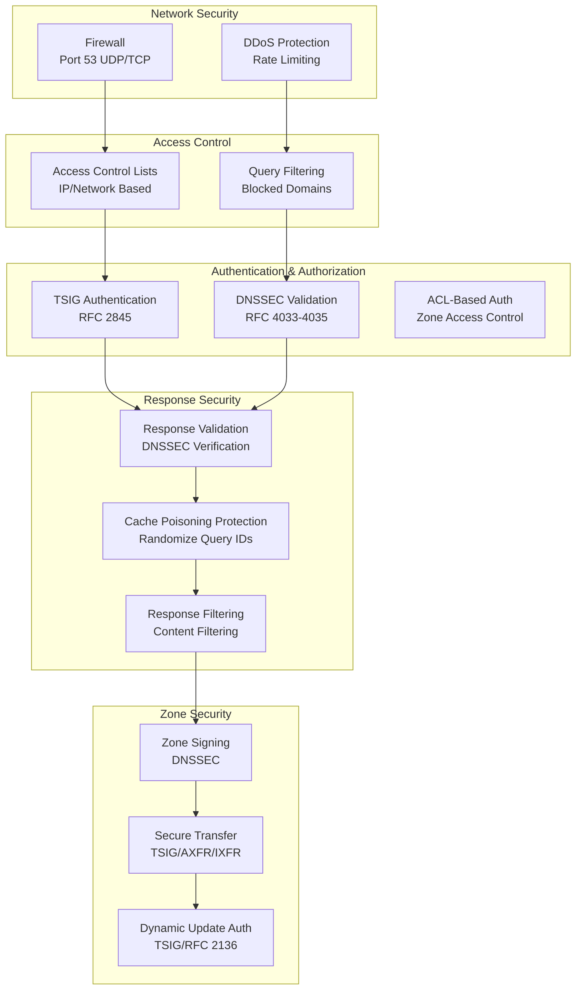
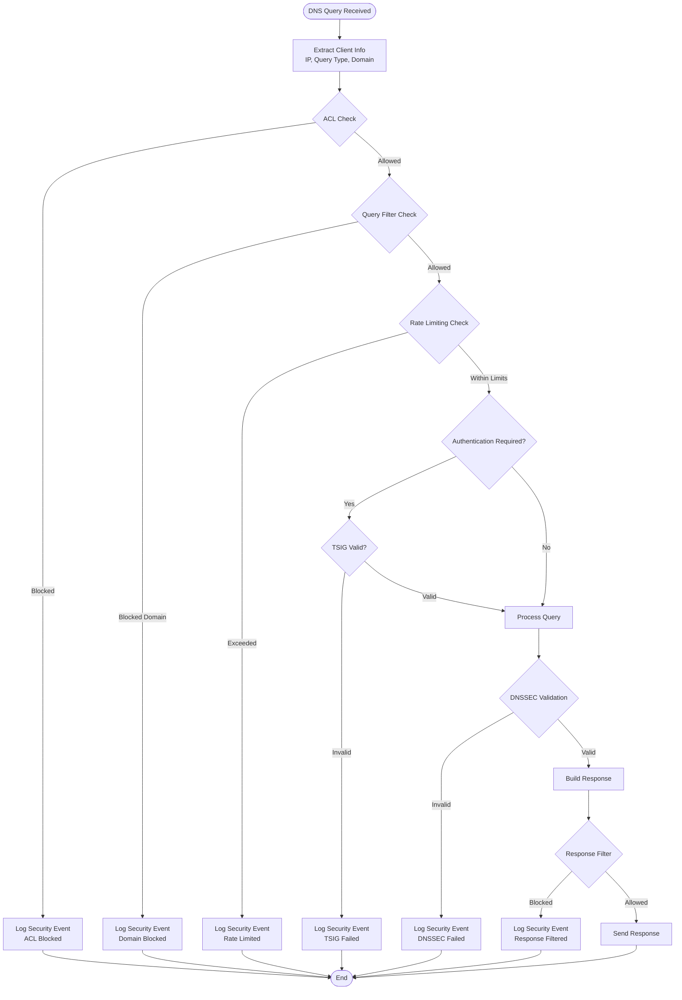
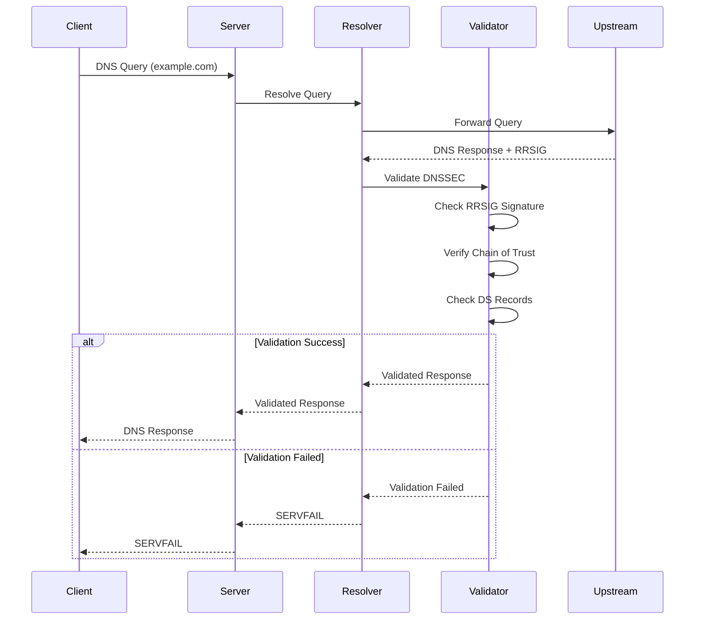
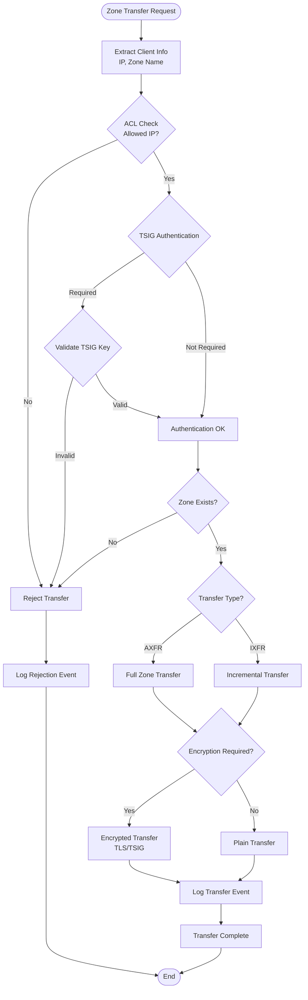
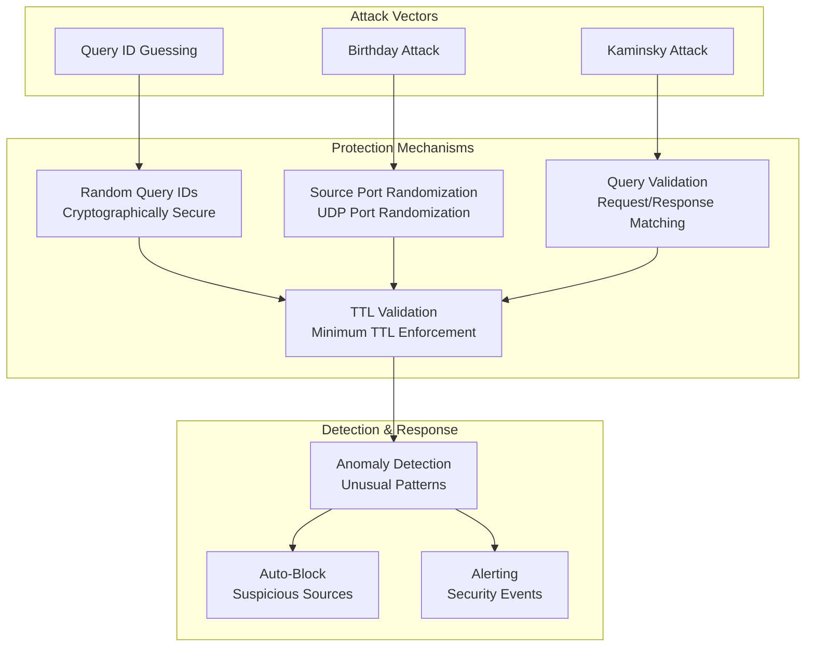

# Simple DNS Daemon - Security Diagrams

## Security Architecture

```mermaid
graph TB
    subgraph "Network Security"
        Firewall[Firewall<br/>Port 53 UDP/TCP]
        DDoSProtection[DDoS Protection<br/>Rate Limiting]
    end

    subgraph "Access Control"
        ACL[Access Control Lists<br/>IP/Network Based]
        QueryFilter[Query Filtering<br/>Blocked Domains]
    end

    subgraph "Authentication & Authorization"
        TSIG[TSIG Authentication<br/>RFC 2845]
        DNSSEC[DNSSEC Validation<br/>RFC 4033-4035]
        ACLAuth[ACL-Based Auth<br/>Zone Access Control]
    end

    subgraph "Response Security"
        ResponseValidation[Response Validation<br/>DNSSEC Verification]
        CachePoisoning[Cache Poisoning Protection<br/>Randomize Query IDs]
        ResponseFilter[Response Filtering<br/>Content Filtering]
    end

    subgraph "Zone Security"
        ZoneSigning[Zone Signing<br/>DNSSEC]
        SecureTransfer[Secure Transfer<br/>TSIG/AXFR/IXFR]
        DynamicUpdateAuth[Dynamic Update Auth<br/>TSIG/RFC 2136]
    end

    Firewall --> ACL
    DDoSProtection --> QueryFilter

    ACL --> TSIG
    QueryFilter --> DNSSEC

    TSIG --> ResponseValidation
    DNSSEC --> ResponseValidation

    ResponseValidation --> CachePoisoning
    CachePoisoning --> ResponseFilter

    ResponseFilter --> ZoneSigning
    ZoneSigning --> SecureTransfer
    SecureTransfer --> DynamicUpdateAuth
```

## Security Flow

```mermaid
flowchart TD
    Start([DNS Query Received]) --> ExtractInfo[Extract Client Info<br/>IP, Query Type, Domain]

    ExtractInfo --> ACLCheck{ACL Check}
    ACLCheck -->|Blocked| LogBlock1[Log Security Event<br/>ACL Blocked]
    ACLCheck -->|Allowed| QueryFilterCheck

    QueryFilterCheck{Query Filter Check}
    QueryFilterCheck -->|Blocked Domain| LogBlock2[Log Security Event<br/>Domain Blocked]
    QueryFilterCheck -->|Allowed| RateLimitCheck

    RateLimitCheck{Rate Limiting Check}
    RateLimitCheck -->|Exceeded| LogBlock3[Log Security Event<br/>Rate Limited]
    RateLimitCheck -->|Within Limits| AuthCheck

    AuthCheck{Authentication Required?}
    AuthCheck -->|Yes| TSIGCheck{TSIG Valid?}
    AuthCheck -->|No| ProcessQuery

    TSIGCheck -->|Invalid| LogBlock4[Log Security Event<br/>TSIG Failed]
    TSIGCheck -->|Valid| ProcessQuery

    ProcessQuery[Process Query] --> DNSSECCheck{DNSSEC Validation}
    DNSSECCheck -->|Invalid| LogBlock5[Log Security Event<br/>DNSSEC Failed]
    DNSSECCheck -->|Valid| BuildResponse

    BuildResponse[Build Response] --> ResponseFilter{Response Filter}
    ResponseFilter -->|Blocked| LogBlock6[Log Security Event<br/>Response Filtered]
    ResponseFilter -->|Allowed| SendResponse

    SendResponse[Send Response] --> End([End])

    LogBlock1 --> End
    LogBlock2 --> End
    LogBlock3 --> End
    LogBlock4 --> End
    LogBlock5 --> End
    LogBlock6 --> End
```

## DNSSEC Validation Flow

```mermaid
sequenceDiagram
    participant Client
    participant Server
    participant Resolver
    participant Validator
    participant Upstream

    Client->>Server: DNS Query (example.com)
    Server->>Resolver: Resolve Query
    Resolver->>Upstream: Forward Query

    Upstream-->>Resolver: DNS Response + RRSIG
    Resolver->>Validator: Validate DNSSEC

    Validator->>Validator: Check RRSIG Signature
    Validator->>Validator: Verify Chain of Trust
    Validator->>Validator: Check DS Records

    alt Validation Success
        Validator-->>Resolver: Validated Response
        Resolver-->>Server: Validated Response
        Server-->>Client: DNS Response
    else Validation Failed
        Validator-->>Resolver: Validation Failed
        Resolver-->>Server: SERVFAIL
        Server-->>Client: SERVFAIL
    end
```

## Zone Transfer Security

```mermaid
flowchart TD
    Start([Zone Transfer Request]) --> ExtractInfo[Extract Client Info<br/>IP, Zone Name]

    ExtractInfo --> ACLCheck{ACL Check<br/>Allowed IP?}
    ACLCheck -->|No| Reject[Reject Transfer]
    ACLCheck -->|Yes| TSIGCheck

    TSIGCheck{TSIG Authentication}
    TSIGCheck -->|Required| ValidateTSIG{Validate TSIG Key}
    TSIGCheck -->|Not Required| AuthOK

    ValidateTSIG -->|Invalid| Reject
    ValidateTSIG -->|Valid| AuthOK

    AuthOK[Authentication OK] --> ZoneCheck{Zone Exists?}
    ZoneCheck -->|No| Reject
    ZoneCheck -->|Yes| TransferType

    TransferType{Transfer Type?}
    TransferType -->|AXFR| FullTransfer[Full Zone Transfer]
    TransferType -->|IXFR| IncrementalTransfer[Incremental Transfer]

    FullTransfer --> EncryptCheck{Encryption Required?}
    IncrementalTransfer --> EncryptCheck

    EncryptCheck -->|Yes| EncryptedTransfer[Encrypted Transfer<br/>TLS/TSIG]
    EncryptCheck -->|No| PlainTransfer[Plain Transfer]

    EncryptedTransfer --> LogTransfer[Log Transfer Event]
    PlainTransfer --> LogTransfer

    LogTransfer --> Complete[Transfer Complete]
    Reject --> LogReject[Log Rejection Event]
    LogReject --> End([End])
    Complete --> End
```

## Cache Poisoning Protection

```mermaid
graph TB
    subgraph "Attack Vectors"
        IDGuessing[Query ID Guessing]
        BirthdayAttack[Birthday Attack]
        KaminskyAttack[Kaminsky Attack]
    end

    subgraph "Protection Mechanisms"
        RandomID[Random Query IDs<br/>Cryptographically Secure]
        SourcePort[Source Port Randomization<br/>UDP Port Randomization]
        QueryValidation[Query Validation<br/>Request/Response Matching]
        TTLValidation[TTL Validation<br/>Minimum TTL Enforcement]
    end

    subgraph "Detection & Response"
        AnomalyDetection[Anomaly Detection<br/>Unusual Patterns]
        AutoBlock[Auto-Block<br/>Suspicious Sources]
        Alert[Alerting<br/>Security Events]
    end

    IDGuessing --> RandomID
    BirthdayAttack --> SourcePort
    KaminskyAttack --> QueryValidation

    RandomID --> TTLValidation
    SourcePort --> TTLValidation
    QueryValidation --> TTLValidation

    TTLValidation --> AnomalyDetection
    AnomalyDetection --> AutoBlock
    AnomalyDetection --> Alert
```
